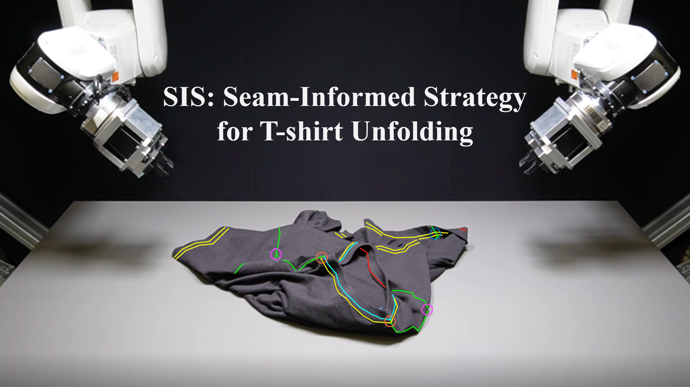

# SIS: Seam-Informed Strategy for T-shirt Unfolding

<!-- cover_image -->

### Latest Video
Here is a video of our project using unseen T-shirts and unseen types of garments in the unfolding task. Each trial consists of 5 episode steps, starting from a randomly placed configuration. The robot performs a randomizing motion and repeats it until the garment configuration is sufficiently crumpled, with a normalized coverage lower than 0.4.
[

### Previous Version

